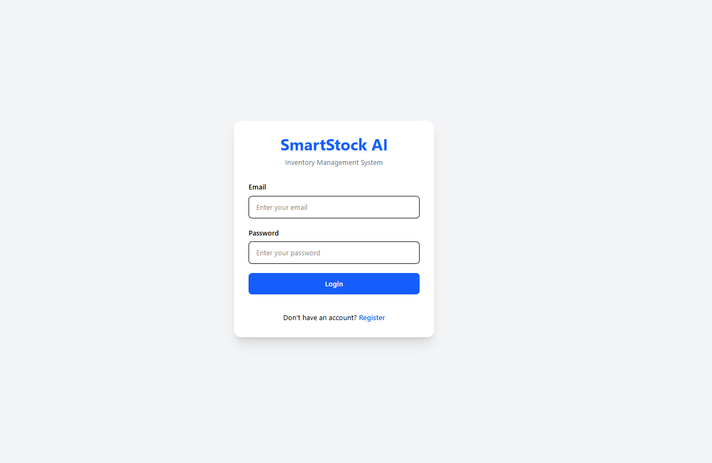
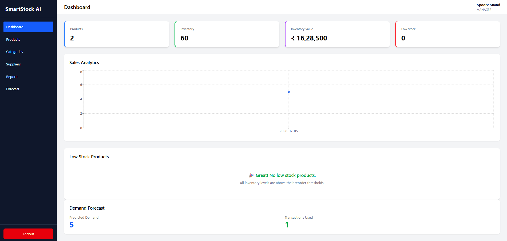
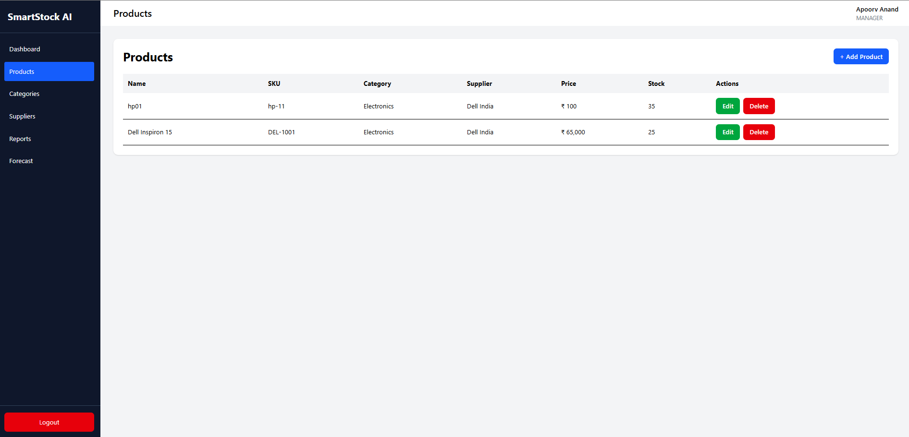
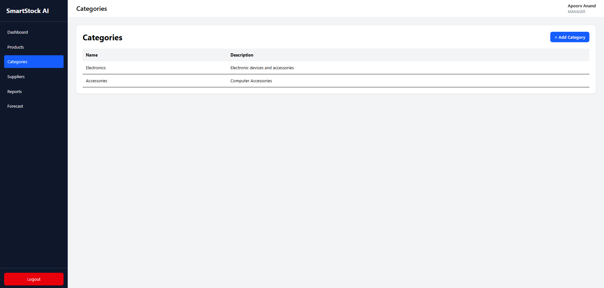
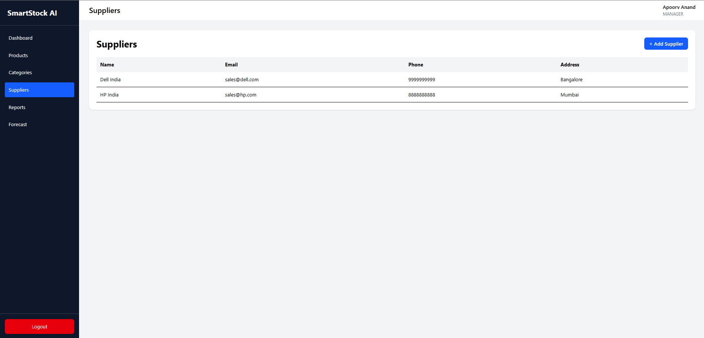
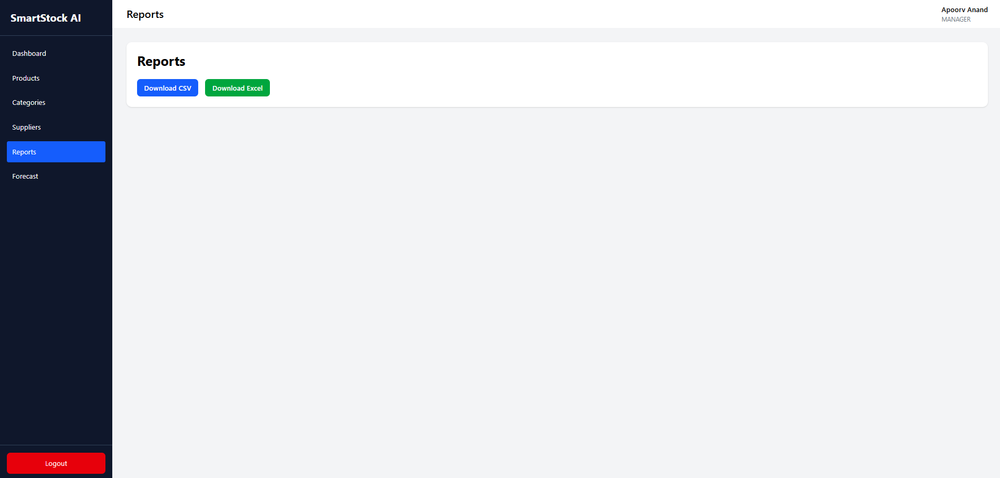
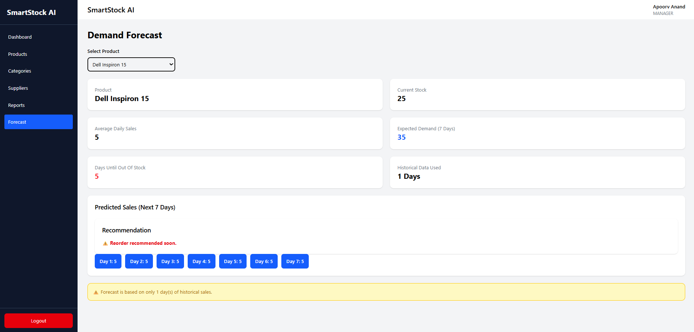

# 📦 SmartStock AI


# 📦 SmartStock AI - Inventory & Demand Forecast Assistant

A full-stack Inventory Management System built using **React.js, Node.js, Express.js, Prisma ORM, and PostgreSQL**. The application helps businesses efficiently manage inventory, suppliers, categories, purchase orders, and inventory transactions while providing dashboard analytics, sales reports, and AI-inspired demand forecasting.

---

## 🚀 Features

### 🔐 Authentication
- User Registration
- User Login
- JWT Authentication
- Protected Routes
- Secure Password Hashing (bcrypt)

### 📦 Inventory Management
- Product Management (CRUD)
- Category Management
- Supplier Management
- Inventory Transactions
- Low Stock Monitoring

### 📊 Dashboard
- Total Products
- Total Inventory
- Inventory Value
- Low Stock Count
- Sales Analytics
- Demand Forecast Summary

### 📈 Reports
- Sales Report
- Top Selling Products
- Export Sales Report as CSV
- Export Sales Report as Excel

### 🤖 Demand Forecast
- Forecast based on historical sales
- Average Daily Sales
- Expected Demand
- Predicted Sales for Next 7 Days
- Days Until Out of Stock
- Reorder Recommendation

---

# 🛠 Tech Stack

## Frontend
- React.js
- React Router DOM
- Axios
- React Hook Form
- Tailwind CSS

## Backend
- Node.js
- Express.js

## Database
- PostgreSQL
- Prisma ORM

## Authentication
- JWT
- bcryptjs

## Reports
- ExcelJS
- json2csv

---

# 📂 Project Structure

```
SmartStock-AI
│
├── backend
│   ├── controllers
│   ├── middleware
│   ├── prisma
│   ├── routes
│   ├── services
│   └── server.js
│
├── frontend
│   ├── components
│   ├── pages
│   ├── routes
│   ├── services
│   └── src
│
├── screenshots
│
└── README.md
```

---

# ⚙️ Installation

## Clone Repository

```bash
git clone https://github.com/YOUR_USERNAME/SmartStock-AI.git

cd SmartStock-AI
```

---

## Backend Setup

```bash
cd backend

npm install
```

Create a `.env` file

```env
DATABASE_URL=your_postgresql_database_url

JWT_SECRET=your_secret_key

PORT=5000
```

Run migrations

```bash
npx prisma migrate dev
```

Start Backend

```bash
npm run dev
```

---

## Frontend Setup

```bash
cd frontend

npm install

npm run dev
```

---

# 📡 API Endpoints

## Authentication

| Method | Endpoint |
|----------|----------------|
| POST | /auth/register |
| POST | /auth/login |

---

## Products

| Method | Endpoint |
|----------|----------------|
| GET | /products |
| POST | /products |
| PUT | /products/:id |
| DELETE | /products/:id |

---

## Categories

| Method | Endpoint |
|----------|----------------|
| GET | /categories |
| POST | /categories |

---

## Suppliers

| Method | Endpoint |
|----------|----------------|
| GET | /suppliers |
| POST | /suppliers |
| PUT | /suppliers/:id |
| DELETE | /suppliers/:id |

---

## Reports

| Method | Endpoint |
|----------|----------------|
| GET | /reports/sales |
| GET | /reports/top-products |
| GET | /reports/export/csv |
| GET | /reports/export/excel |

---

## Forecast

| Method | Endpoint |
|----------|----------------|
| GET | /forecast/:productId |

---

# 📸 Screenshots

### Login



---

### Dashboard



---

### Products



---

### Categories



---

### Suppliers



---

### Reports



---

### Forecast



---

# 🔮 Future Enhancements

- Role-Based Access Control (RBAC)
- Multi-Warehouse Management
- Barcode Scanner Integration
- Email Notifications
- Real-time Inventory Updates
- Machine Learning Based Forecasting
- Docker Support
- Cloud Deployment
- Analytics Dashboard with Charts

---

# 💡 Key Learning Outcomes

- REST API Development
- JWT Authentication
- Prisma ORM
- PostgreSQL Database Design
- React Component Architecture
- State Management
- CRUD Operations
- Demand Forecasting Logic
- CSV & Excel Report Generation
- Full Stack Application Development

---

# 👨‍💻 Author

**Apoorv Anand**

GitHub: https://github.com/apoorvanand-31

---

## ⭐ If you found this project useful, consider giving it a star!